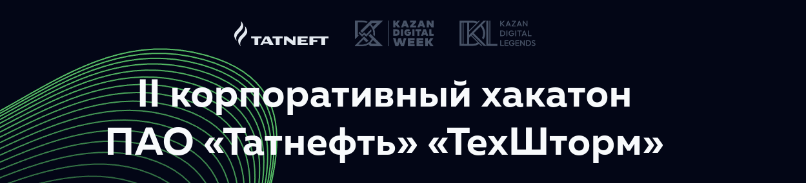

# Анализ активности команд по видео 360°



## Ссылки

Сайт соревнования: [itcongress.tatneft.tatar](https://itcongress.tatneft.tatar/) \
GitHub: [github.com/werserk/TechStorm-hack](https://github.com/werserk/TechStorm-hack/) \
Презентация: [LINK](https://docs.google.com/presentation/d/1CF9RO24Hzh5-FVmpxpWyX9oChEJhYoVV/edit?usp=sharing&ouid=116202268270672729224&rtpof=true&sd=true)

## Установка

### Разработка

### Основной запуск

Склонируйте репозиторий:

```bash
git clone https://github.com/werserk/TechStormHack.git && cd TechStormHack
```

Запустите Docker:

```bash
docker compose up
```

### Запуск для разработки

Установите зависимости в систему:

```bash
sudo apt-get install build-essential cmake &&
sudo apt-get install libgtk-3-dev &&
sudo apt-get install libboost-all-dev &&
sudo apt-get install libportaudio2 && 
sudo apt-get install portaudio19-dev
```

Создайте виртуальное окружение и активируйте его:

```bash
virtualenv -p python3 venv && source venv/bin/activate
```

Установите зависимости:

```bash
poetry install
```

Запуск веб-интерфейса:

```bash
streamlit run main.py
```
